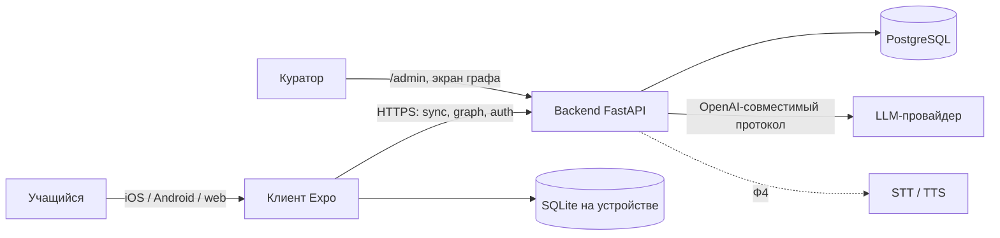
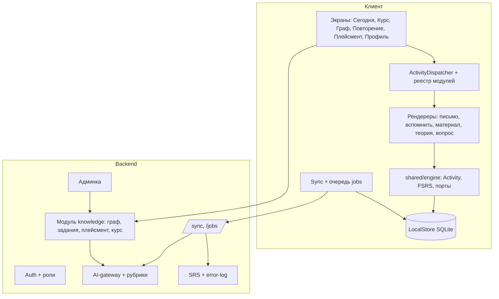
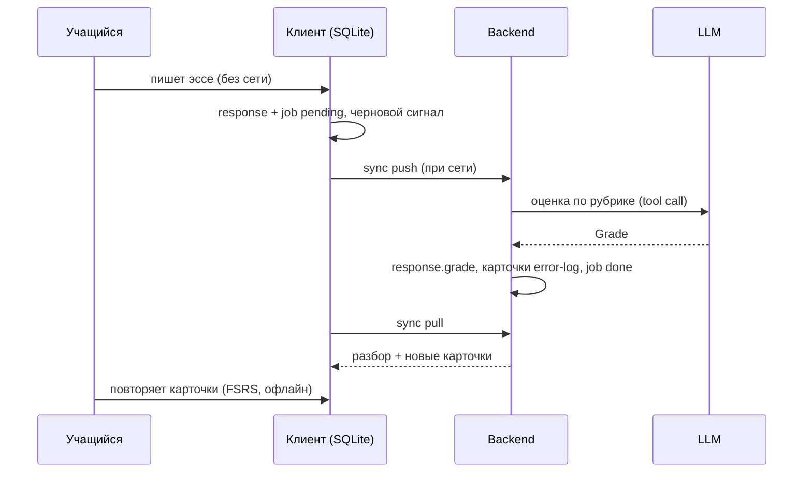
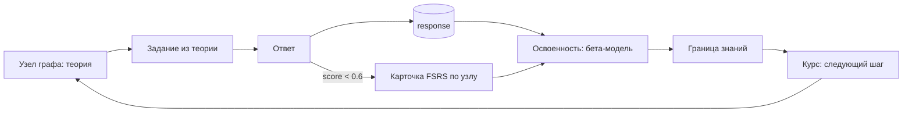

# 06 — Карта системы

Функциональная карта: какие части есть, что каждая делает, как они связаны и где лежат в коде. Это путеводитель; детали — в [01](./01-architecture.md)…[05](./05-knowledge-model.md) и в [спеках](../20-specs/README.md). Состояние на 2026-09-30.

## 1. Контекст: кто с чем общается

Клиент работает без сети только с SQLite. Backend — единственный, кто говорит с LLM (инвариант №2).

## 2. Функциональные области

| Область | Что делает | Спека | Клиент | Backend |
|---|---|---|---|---|
| Движок Activity | Единый примитив; диспетчеризация по `type` | [SPEC-01](../20-specs/SPEC-01-activity-engine.md) | `shared/engine`, `widgets/module-registry` | `modules/*`, *(цель: реестр модулей)* |
| Аккаунт | Регистрация, вход, восстановление, роли | [SPEC-02](../20-specs/SPEC-02-auth-and-roles.md) | `pages/auth`, `entities/session` | `core/routers/auth.py` |
| Sync и очередь | Push/pull, отложенные AI-задачи | [SPEC-03](../20-specs/SPEC-03-sync-and-jobs.md) | `shared/api/sync-*`, `job-queue` | `core/routers/sync.py`, `core/jobs.py` |
| AI-gateway | Вызовы LLM, рубрики, заглушка | [SPEC-04](../20-specs/SPEC-04-ai-gateway-and-rubrics.md) | — | `core/ai_gateway` |
| Повторение | FSRS, error-log | [SPEC-05](../20-specs/SPEC-05-srs-and-error-log.md) | `pages/review`, `scheduler` | `core/srs.py` |
| Письмо | Эссе IELTS с оценкой | [SPEC-06](../20-specs/SPEC-06-writing.md) | `features/ielts-writing` | `modules/languages` |
| ML-трек | Материал, вспомнить | [SPEC-07](../20-specs/SPEC-07-ml-track.md) | `features/material-read`, `concept-recall` | `modules/ml` |
| Граф знаний | Канон + персональный слой | [SPEC-08](../20-specs/SPEC-08-knowledge-graph.md) | `features/graph-editor` | `modules/knowledge` |
| Задания | Из теории узла | [SPEC-09](../20-specs/SPEC-09-assessment.md) | — | `knowledge/assessment*.py` |
| Плейсмент | Карта освоенности | [SPEC-10](../20-specs/SPEC-10-placement.md) | `features/placement` | `knowledge/{mastery,placement}.py` |
| Курс | Путь и петля освоения | [SPEC-11](../20-specs/SPEC-11-course-and-study.md) | `features/course`, `concept-study` | `knowledge/{course,study}.py` |
| Опыт учащегося | Онбординг, «Сегодня», словари | [SPEC-12](../20-specs/SPEC-12-learner-experience.md) | `pages/*`, `shared/config/design.ts` | — |
| Администрирование | Панель, CLI, курирование | [SPEC-13](../20-specs/SPEC-13-admin-and-curation.md) | `graph-curation` | `core/admin.py`, `scripts/` |
| Речь, рецепция | Будущее | [SPEC-14](../20-specs/SPEC-14-speaking.md), [15](../20-specs/SPEC-15-reception-drills.md) | — | — |
| Расширение, релиз | Будущее | [SPEC-16](../20-specs/SPEC-16-learning-expansion.md), [17](../20-specs/SPEC-17-platform-and-release.md) | — | — |

## 3. Сквозной поток данных

## 4. Петля освоения узла

## 5. Где что проверяется

Каталог проверок — [10-requirements/verification.md](../10-requirements/verification.md). Порядок задач — [50-plans/priorities.md](../50-plans/priorities.md).
