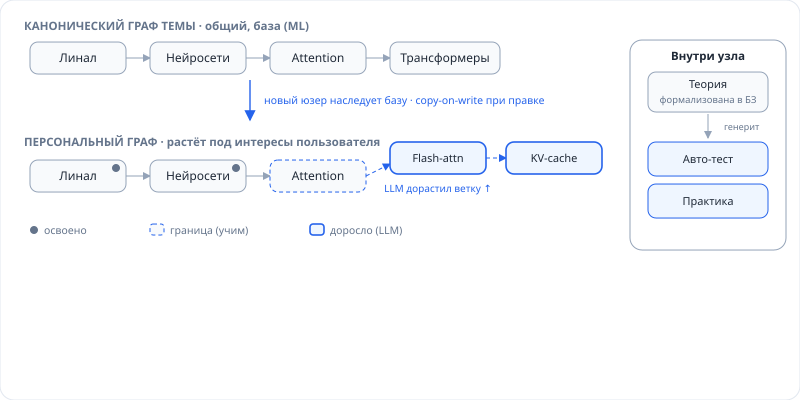
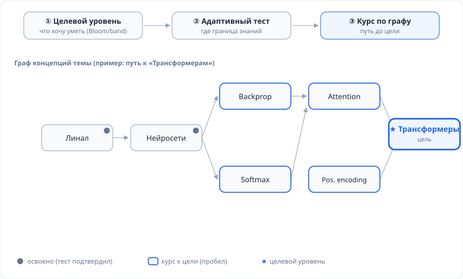
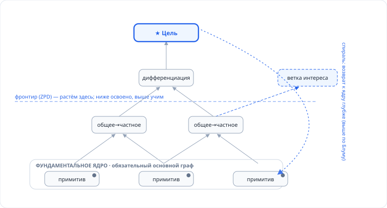

# 05 — Модель знаний (граф, развитие, адаптивные курсы)

Слой **модели знаний** — ядро-актив Praxis: формализованная база знаний в виде графа концепций, из которой генерируются тесты, практика и персональные курсы. Лежит **над** движком Activity ([02 — Логический план](./02-logical.md)), не нарушая доменной независимости ядра.

Функциональные сценарии — [03](./03-functional.md); FSD клиента — [04](./04-frontend-fsd.md).

---

## 1. Роль слоя и главная идея

Ошибка «плоского» MVP: карточки и активности изолированы, система не знает, *как знания связаны*. Модель знаний закрывает это одним слоем:

- **Контекст термина** — узел графа знает соседей (предпосылки, связанные, противопоставления, примеры).
- **Система в целом** — структура графа = карта предметной области.
- **Уровень и курс** — есть чем измерить, где пользователь, и построить путь до цели.

**LLM-облако → граф.** LLM держит знания как *разрозненное облако*: огромное, но без порядка, предпосылок и модели ученика. Мы используем LLM как генератор, но **кристаллизуем его вывод в устойчивый версионированный граф** — который даёт то, чего у облака нет: обязательное ядро, prerequisite-порядок, модель освоенности, воспроизводимость, курирование. Граф — это «застывшая» и организованная под ученика часть облака.

**Граф — это данные, а не логика ядра.** `shared/engine` про граф не знает (инвариант доменной независимости). Граф живёт в модуле (`ml`, позже `languages`) и на backend.

---

## 2. Два уровня графа (canonical + personal, copy-on-write)



| Уровень | Что | Кто владеет |
|---|---|---|
| **Канонический** | общий, кураторская база темы (напр. ML) — узлы + связи + теория | система (курируется) |
| **Персональный** | стартует как канон, **растёт под интересы**; освоенность, заметки, персональные узлы/ветки | пользователь |

**Copy-on-write (COW):**
- Новый пользователь **не копирует** канон — читает его сквозняком.
- При правке узла или росте ветки (LLM дорастил) создаётся **персональный узел поверх**, перекрывающий канонический.
- Освоенность (`mastery`) — всегда персональная.
- Улучшения канона видны всем, у кого узел не перекрыт.

### 2.1 Тир: фундаментальное ядро vs вытекающие ветви

Внутри **канона** узлы размечены тиром — это ключ к «фундаментальным знаниям» и «побочным ветвям»:

- **`core` — фундаментальное ядро (обязательное).** «Ствол» области: примитивы и узлы высокой центральности, от которых зависит почти всё. Курируется, стабильно, **обязательно к прохождению** для любой цели в области. Это «основной граф».
- **`derived` — вытекающие ветви.** Растут **поверх** ядра: генерируются LLM, персонализируются под интересы/цель, опциональны, версионируются.

`personal`-граф (COW) — это `derived`-ветви, доросшие поверх ядра у конкретного пользователя.

---

## 3. Узел как контейнер теории

Узел — **не ярлык, а формализованная единица знания**:

```
concept {
  id, domain, title,
  tier: 'core' | 'derived',   // фундаментальное ядро / вытекающая ветвь
  centrality,                  // мера «фундаментальности» (для core-детекции)
  content: {                   // ТЕОРИЯ, формализованная в БЗ
    summary,
    sections: [{ heading, body, examples[], counter_examples[] }],
    references[]               // источники (заземление)
  },
  bloom_levels[], difficulty,
  source: 'curated' | 'llm' | 'material',
  confidence, version
}
```

**Генерация оценок заземлена на `content`** узла (а не «свободная») → меньше галлюцинаций, воспроизводимо, версионируемо. Из теории узла детерминированно рождаются **тест-айтемы** (recall/understand) и **практические задания** (apply/create) с тегами Блума, кэшируемые (`assessment`), регенерируемые при смене версии узла.

---

## 4. Модель данных

Copy-on-write разнесён на канонический (глобальный) и персональный слои.

```sql
-- КАНОНИЧЕСКИЙ (глобальный)
concept (
  id uuid pk, domain text, title text,
  tier text,               -- 'core' | 'derived'
  centrality real,         -- мера фундаментальности
  content jsonb,           -- теория (см. §3)
  bloom_levels text[], difficulty int,
  source text, confidence real, version int,
  status text              -- 'draft' | 'approved'
)
concept_edge (
  id uuid pk, from_id uuid, to_id uuid,
  type text                -- 'prereq' | 'specializes' | 'part_of' | 'related' | 'contrasts' | 'misconception' | 'example'
)

-- ПЕРСОНАЛЬНЫЙ (поверх канона, COW)
user_concept (
  id uuid pk, user_id uuid,
  base_concept_id uuid null,   -- ссылка на canonical; null = свой узел
  content_override jsonb null,
  mastery jsonb,               -- {estimate, confidence, bloom_reached}
  status text,                 -- 'locked'|'frontier'|'learning'|'known'
  origin text                  -- 'inherited'|'edited'|'grown_llm'
)
user_edge ( id uuid pk, user_id uuid, from_id uuid, to_id uuid, type text )

-- ГЕНЕРАЦИЯ ОЦЕНОК (кэш, заземлён на версию узла)
assessment (
  id uuid pk, concept_id uuid, concept_version int,
  kind text,               -- 'probe' | 'test' | 'practice'
  bloom text, payload jsonb, created_at timestamptz
)

-- КУРС
course (
  id uuid pk, user_id uuid, domain text,
  target jsonb,            -- {concepts[], bloom}
  path jsonb, progress jsonb, created_at timestamptz
)
```

**Эффективный узел** (COW-чтение): `user_concept.content_override` если есть, иначе `concept.content`. CRUD — по `user_concept`/`user_edge` (персонально) и по `concept`/`concept_edge` (канон, только курирование).

### Ребра
- `prereq` — предпосылка (обязательный порядок).
- `specializes` / `part_of` — общее→частное (прогрессивная дифференциация).
- `related`, `example`, `contrasts` — контекст.
- `misconception` — типичное заблуждение/наивная модель (для починки, §7).

---

## 5. Уровни понимания

«Нужный уровень» — ось, а не число:
- **Технологии:** Блум — Remember → Understand → Apply → Analyze → Evaluate → Create.
- **Язык:** CEFR / IELTS band.

Хранится как `concept.bloom_levels` (доступные ступени) + `user_concept.mastery.bloom_reached`. Оценки тегируются ступенью. Цель курса = целевая ступень над множеством концепций.

---

## 6. Освоенность и адаптивный плейсмент



**Первый шаг — пользователь задаёт цель** (набор концепций + целевая ступень Блума). Это потолок.

**Адаптивный тест (CAT-подобный, lite):**
1. Приор освоенности узла — из предпосылок (освоил предков → выше приор).
2. Зонд подбирается на **границе знаний** (макс. неопределённость), генерится из `content` на ступени Блума.
3. Ответ (объективный или AI-оценённый) обновляет оценку **байесовски** (не полноценный IRT — калибровка позже).
4. Стоп по уверенности/бюджету.

Итог — **карта mastery** по узлам → «граница» (освоено / фронтир / неизвестно).

---

## 7. Развитийная модель курса

Курс — **не топосорт, а симуляция развития**: мы проигрываем на графе ту траекторию, по которой человек углубляется в сферу.



### 7.1 Принципы развития → механика графа

| Принцип (когнитивистика) | Механика на графе | Правило курса |
|---|---|---|
| **Ядро-знания сначала** | тир `core`, высокая `centrality` | нельзя в ветки, пока не освоено ядро |
| **Ассимиляция/аккомодация** (Пиаже) | узел цепляется к «якорям»; конфликт = `contrasts`/`misconception` | вводить узел лишь когда предпосылки ~освоены; чинить заблуждения |
| **Прогрессивная дифференциация** (Аусубель) | `specializes`/`part_of` (общее→частное) | обзорный узел (advance organizer) → детали |
| **ЗБР / скаффолдинг** (Выготский) | фронтир = узлы с освоенными предпосылками | следующий узел на фронтире, worked example → faded |
| **Спиральная программа** (Брунер) | тот же узел на более высоком Блуме | пере-встречи узла с нарастанием ступени |
| **Любопытство → углубление** | рост `derived`-веток в сторону интереса | опциональные боковые ветки (LLM-рост, персонал) |
| **Bootstrapping / чанкинг** | освоенный кластер → композитный узел | распознавать чанки, строить поверх |

### 7.2 Алгоритм генерации курса

1. **Укоренение.** Проверить/добить освоение **ядра** (`tier=core`). Нет ядра → курс начинается с него, независимо от цели.
2. **Дифференциация к цели.** От фронтира растём по `prereq`/`specializes`, общее→частное, в ЗБР (не вводим узел без якорей).
3. **Ветвление по интересу.** Пристёгиваем `derived`-ветки туда, куда указывают цели/любопытство (LLM-рост + подтверждение).
4. **Спираль.** По мере углубления пере-поднимаем ранние узлы ядра на более высокий Блум.
5. **Консолидация и починка.** FSRS держит удержание; распознаём освоенные чанки; заблуждения (`misconception`-рёбра) чиним контраст-активностями.

Под каждый узел — цепочка активностей движка `concept_study → concept_recall → apply → srs` с нарастанием Блума + interleaving. Движок про граф не знает — планировщик курса (модуль) упорядочивает активности по графу.

«Объём знаний» = размер выращенного подграфа (узлы × глубина × ступень); «уровень» = положение фронтира.

---

## 8. Рост графа и governance

Чтобы граф (ядро-актив) не «поплыл»:
- LLM-предложения узлов/связей — **draft с `confidence`** → пользователь **Approve / Edit / Reject**.
- **Core-детекция:** при построении графа LLM помечает кандидатов в ядро (по centrality/частоте-как-предпосылки), куратор подтверждает `tier=core`.
- Теория узла **заземлена на источник** (`source='material'`) либо помечена `source='llm'` (не верифицировано).
- **Версионирование** узла; `assessment` помнит `concept_version` ([инвариант №6](../README.md)).
- Рост персонального графа: `expand_node(concept, direction)` → персональные `user_concept`/`user_edge` (COW).
- **Промоция в канон** — качественные персональные узлы → кандидаты в канон (курирование, позже).

---

## 9. Как ложится на существующую архитектуру

- **Ядро (`shared/engine`)** — без изменений и без доменного кода; граф — данные модуля.
- **Backend: слой живёт в пакете `learningBack/modules/knowledge/`** — свои ORM-модели, схемы, COW-чтение (`cow.py`), centrality (`centrality.py`), AI-роли (`ai.py`) и роутер. `core/` подключает только роутер и про граф не знает; зависимость односторонняя (`knowledge → core`). Таблицы делят общую `core.db.Base` — миграционная линия одна.
- **AI-роли слоя** — `build_graph(topic)` (с пометкой ядра) · `expand_node(concept, direction)` · `generate_assessment(content, bloom, kind)` · `estimate_mastery(probe, answer)` · `generate_course(gap)`. Живут в `modules/knowledge/ai.py` вместе со своей JSON-схемой и промптами; ядро даёт лишь доменно-нейтральный `AIGateway.structured(tool, schema, prompt)`. Детерминированные фикстуры «без ключа» — тоже в модуле.
- **Новые типы Activity:** `placement_probe`, `concept_study` (+ переиспользуем `concept_recall`, `code_task`, `srs`).
- **FSRS** — без изменений; держит удержание атомов внутри узлов.
- **Клиент (FSD):** `features/graph-editor` + `entities/concept`, экраны плейсмента и курса (`pages/*`).

---

## 10. Инварианты слоя

1. **Ядро не знает про граф.** Граф — данные модуля; планировщик (модуль) упорядочивает активности.
2. **Генерация заземлена на `content` узла**, не «свободная».
3. **Персональный слой поверх канона (COW).** Канон неизменен для пользователя (только курирование).
4. **Фундаментальное ядро (`tier=core`) обязательно** — курс не ведёт к цели в обход непокрытого ядра.
5. **Узлы версионируются; оценки помнят версию контента.**
6. **LLM-узлы — draft с confidence** до подтверждения.

---

## 11. Открытые вопросы

1. **Core-детекция** — как определяем `tier=core`: centrality графа / частота-как-предпосылки / вручную при курировании (вероятно гибрид).
2. **Гранулярность узла** — что считать одним концептом.
3. **Модель освоенности** — скаляр на узел vs per-(узел, ступень Блума).
4. **Старт калибровки зондов** — эвристика сложности до IRT.
5. **Двухуровневый граф для языкового домена** — язык менее иерархичен; как ложатся канон+персонал и `tier=core`.
