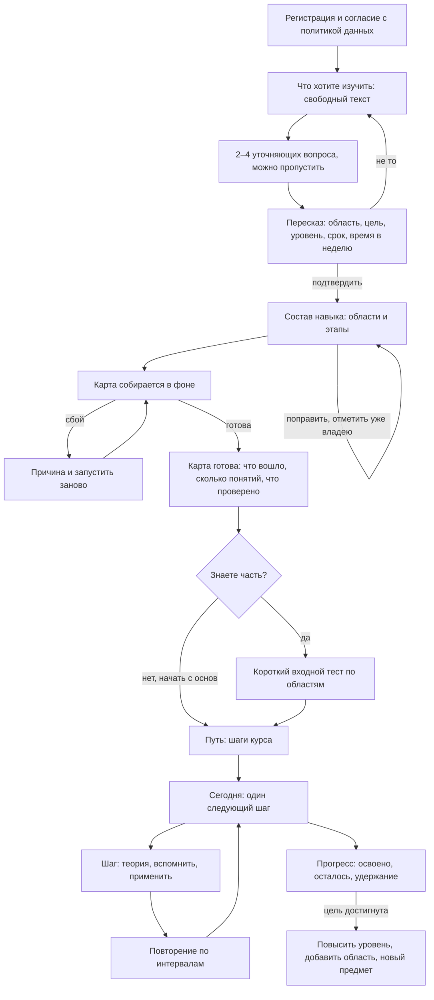

# Сквозной путь учащегося: от «хочу выучить» до «умею»

Это главная заметка по теме. Остальные — `user-flow-navigation`, `user-flow-first-run`,
`user-flow-skill-composition`, `user-flow-daily-loop`, `user-flow-curator`, `user-flow-screens`.
Что не так сейчас — `user-flow-as-is-problems`.

## Принципы

1. **Человек всегда знает три вещи:** где он, что делать дальше и сколько осталось. Это про каждый экран,
   а не только про «Сегодня».
2. **Центральная сущность — предмет (цель человека), а не модуль или экран.** Сегодня, путь, карта и прогресс
   — четыре взгляда на один предмет, и предмет переключается из шапки.
3. **Любая долгая работа видна.** Сборка карты, разбор источника, проверка эссе: есть состояние «идёт, N мин»,
   можно уйти, по готовности приходит сообщение. Нет ни бесконечного индикатора, ни молчания.
4. **Машинные слова не доходят до учащегося:** «профиль навыка», «канон», «черновик», «скелет», «источник»
   переводятся в человеческие («состав навыка», «ещё не проверено куратором», «откуда знания»).
5. **Спрашиваем один раз.** Уровень, срок, время в неделю называются при постановке цели и дальше только
   читаются; повторный вопрос возможен лишь как явное «изменить цель».
6. **Следующий шаг всегда один.** Альтернативы — спокойной строкой ниже, а не конкурирующими кнопками.
7. **Учёба и курирование не смешиваются.** Куратор работает в своём разделе.
8. **Без сети работает то, что можно делать руками:** повторение и шаги с уже полученным содержимым.

## Состояния предмета

У предмета у человека один из таких статусов; от него зависит, что показывает «Сегодня» и что открывает «Путь».

| Состояние | Что это значит для человека | Главное действие |
|---|---|---|
| Нет предмета | Только вошёл | «Что хотите изучить?» |
| Цель ставится | Идёт диалог уточнений | Ответить / пропустить |
| Состав навыка | Показан перечень областей и этапов | Поправить и «Собрать карту» |
| Карта собирается | Работа идёт в фоне | Ничего; можно пользоваться повторением |
| Сборка не удалась | Причина + «Запустить заново» | Запустить заново |
| Карта готова, уровень неизвестен | Карта есть, откуда стартовать — нет | «Определить, что уже знаю» (≈5 мин) или «Начать с основ» |
| Идёт путь | Есть шаг курса | Следующий шаг |
| Путь пуст, есть повторение | Интервал подошёл | Повторение |
| Цель достигнута | Всё освоено до выбранного уровня | Поднять уровень / добавить область / новый предмет |
| На паузе | Человек сам отложил | «Вернуться» |

## Сквозная схема

## Что считается сделанным

- Новый человек доходит от входа до первого шага пути без «тупиков»: ни на одном экране нет пустой формы
  без объяснения, что дальше.
- До подтверждения цели не больше 3 минут и не больше 4 экранов.
- Между подтверждением цели и готовой картой человек видит ход и может уйти; готовность сообщается без
  его участия.
- Один вопрос про уровень на весь путь.
- Любое состояние из таблицы выше имеет свой вид на «Сегодня».

## Открытые вопросы (нужно решение человека)

1. **Несколько предметов сразу или один активный?** Предлагаю: несколько, один активный в шапке; повторение
   общее для всех. Сейчас в коде предмет один.
2. **Входной тест до сборки или после?** Предлагаю после состава навыка, до сборки: тест по областям
   сразу отсекает то, что человек уже знает, и сборка идёт короче. Подробно — `user-flow-skill-composition`.
3. **Показывать ли учащемуся «проверено / не проверено куратором»?** Предлагаю да, одной меткой на понятии.
